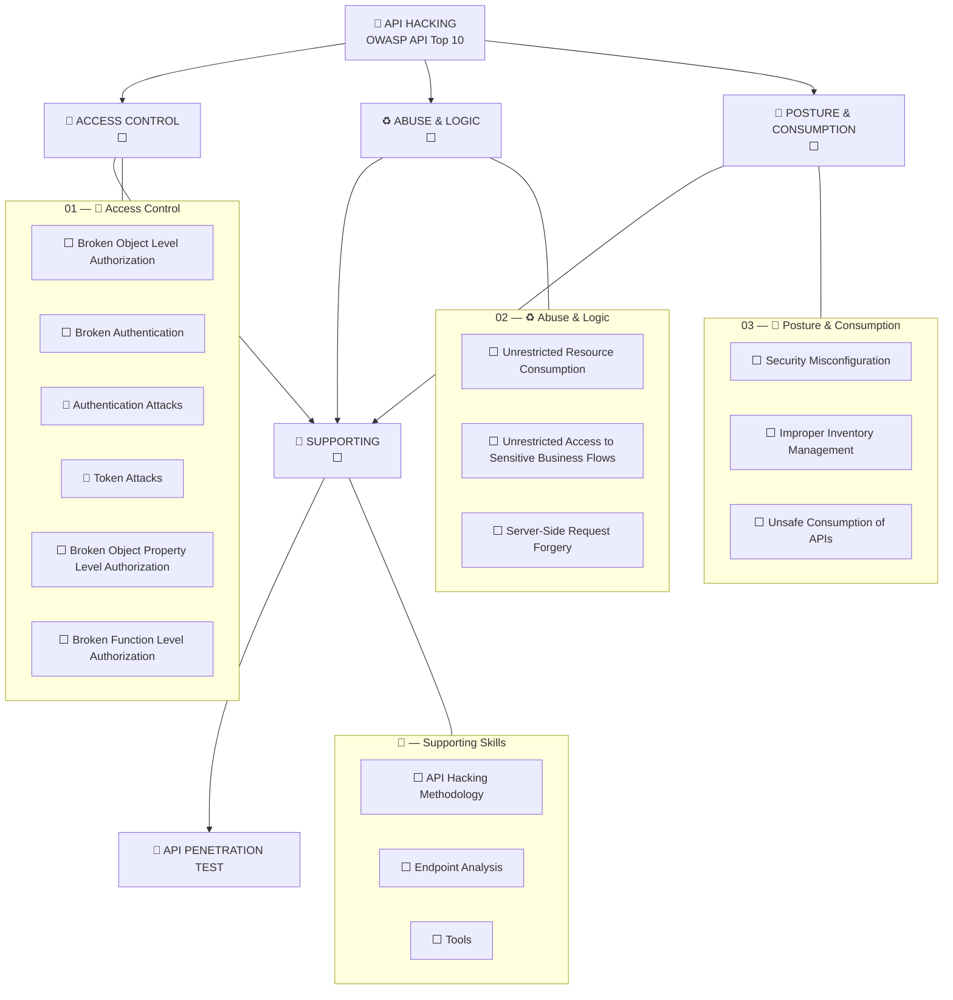

# 🔌 API Hacking

> My structured path to hacking APIs — from BOLA to business-logic abuse.
>
> Three domains → individual vulnerabilities → technical notes → practical labs → API penetration testing.

> [⬅ My Hacking Hub](https://github.com/romeo-mhakayakora/Hacking-Hub) · [🌐 CPTS Notes Site](https://romeo-mhakayakora.github.io/CPTS/)

---

## 🗺️ API Hacking Map

> Every node below is clickable — it takes you directly to its notes.



### Legend

| Status | Meaning |
|--------|---------|
| ✅ | Vulnerability mastered + notes written |
| 🔄 | Currently practicing |
| ⬜ | Not started |
| 🔁 | Needs review / practical reinforcement |

---

## 📊 Overall Progress

| Domain | OWASP Coverage | Status | Entry Point |
|--------|:--------------:|:------:|-------------|
| 🔐 Access Control | API1, API2, API3, API5 | ⬜ | [Open →](./01-access-control/) |
| ♻️ Abuse & Logic | API4, API6, API7 | ⬜ | [Open →](./02-abuse-logic/) |
| 🧱 Posture & Consumption | API8, API9, API10 | ⬜ | [Open →](./03-posture-consumption/) |
| 🧰 Supporting Skills | — | ⬜ | [Open →](./supporting/) |

---

---

## 01 — 🔐 Access Control

> Who can access what: objects, functions, properties. → [Domain README](./01-access-control/README.md)

| Module | OWASP | Status | Notes |
|--------|:-----:|:------:|:-----:|
| [Broken Object Level Authorization (BOLA)](./01-access-control/bola.md) | API1:2023 | ⬜ | [📖](./01-access-control/bola.md) |
| [Broken Authentication](./01-access-control/broken-authentication.md) | API2:2023 | ⬜ | [📖](./01-access-control/broken-authentication.md) |
| [Authentication Attacks](./01-access-control/authentication-attacks.md) | API2:2023 | 🔄 | [📖](./01-access-control/authentication-attacks.md) |
| [Token Attacks](./01-access-control/token-attacks.md) | API2:2023 | 🔄 | [📖](./01-access-control/token-attacks.md) |
| [Broken Object Property Level Authorization (Mass Assignment)](./01-access-control/bopla.md) | API3:2023 | ⬜ | [📖](./01-access-control/bopla.md) |
| [Broken Function Level Authorization](./01-access-control/bfla.md) | API5:2023 | ⬜ | [📖](./01-access-control/bfla.md) |

---

## 02 — ♻️ Abuse & Logic

> Abusing how the API behaves: resources, flows, server-side requests. → [Domain README](./02-abuse-logic/README.md)

| Module | OWASP | Status | Notes |
|--------|:-----:|:------:|:-----:|
| [Unrestricted Resource Consumption](./02-abuse-logic/unrestricted-resource-consumption.md) | API4:2023 | ⬜ | [📖](./02-abuse-logic/unrestricted-resource-consumption.md) |
| [Unrestricted Access to Sensitive Business Flows](./02-abuse-logic/unrestricted-business-flow.md) | API6:2023 | ⬜ | [📖](./02-abuse-logic/unrestricted-business-flow.md) |
| [Server-Side Request Forgery (SSRF)](./02-abuse-logic/ssrf.md) | API7:2023 | ⬜ | [📖](./02-abuse-logic/ssrf.md) |

---

## 03 — 🧱 Posture & Consumption

> Configuration, inventory, and trusting third parties. → [Domain README](./03-posture-consumption/README.md)

| Module | OWASP | Status | Notes |
|--------|:-----:|:------:|:-----:|
| [Security Misconfiguration](./03-posture-consumption/security-misconfiguration.md) | API8:2023 | ⬜ | [📖](./03-posture-consumption/security-misconfiguration.md) |
| [Improper Inventory Management (Shadow APIs)](./03-posture-consumption/improper-inventory-management.md) | API9:2023 | ⬜ | [📖](./03-posture-consumption/improper-inventory-management.md) |
| [Unsafe Consumption of APIs](./03-posture-consumption/unsafe-api-consumption.md) | API10:2023 | ⬜ | [📖](./03-posture-consumption/unsafe-api-consumption.md) |

---

## 🧰 — Supporting Skills

> Methodology and tooling supporting all API attacks. → [Domain README](./supporting/README.md)

| Module | OWASP | Status | Notes |
|--------|:-----:|:------:|:-----:|
| [API Hacking Methodology (Recon to Exploitation)](./supporting/01-api-methodology.md) | — | ⬜ | [📖](./supporting/01-api-methodology.md) |
| [API Endpoint Analysis](./supporting/02-api-endpoint-analysis.md) | — | ⬜ | [📖](./supporting/02-api-endpoint-analysis.md) |
| [Tools (Burp, Postman, ffuf, JWT Tooling)](./supporting/03-tools.md) | — | ⬜ | [📖](./supporting/03-tools.md) |


## 🧭 Suggested Order

```text
API Discovery & Mapping
      ↓
BOLA
      ↓
Broken Authentication
      ↓
BFLA / BOPLA
      ↓
SSRF
      ↓
Rate Limits & Business Flow
      ↓
Misconfig & Shadow APIs
```

## ✅ Readiness

A vulnerability counts as mastered when I can explain it, exploit it against an unfamiliar target, troubleshoot failures, document evidence, and chain it with other techniques.

---

[⬆ Back to top](#-api-hacking)
